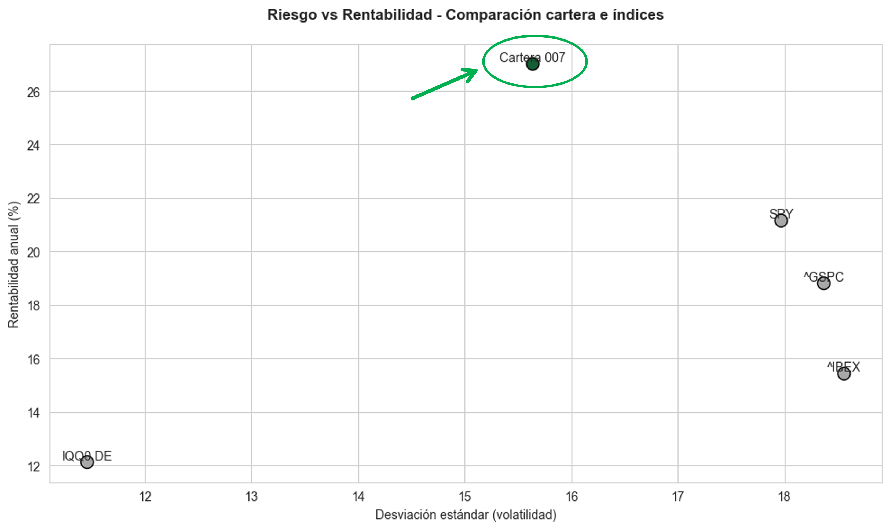

# OPTIMIZACIÓN DE CARTERAS

## Objetivo
Diseñar una **cartera óptima compuesta por 10 activos** que supere en rendimiento ajustado por riesgo al **IBEX 35** y al **S&P 500**, utilizando un enfoque cuantitativo basado en la teoría moderna de carteras y el ratio de Sharpe.

---

## Enfoque Metodológico

### 1. Selección inicial de activos
Selección de 60 activos globales:
  - **Regiones:** Estados Unidos, Europa, China
  - **Sectores:** Tecnología, consumo, salud, energía, lujo, etc.

### 2. Análisis cuantitativo
Cálculo de:
  - **Rentabilidad media anual**
  - **Volatilidad anual (desviación estándar)**
  - **Correlaciones cruzadas** entre activos

### 3. Filtrado por criterios de eficiencia
Se seleccionaron activos con:
  - **Rentabilidad anual > 11.5%**
  - **Volatilidad < 40%**

### 4. Optimización de la cartera
- Objetivo técnico: **Maximizar el ratio de Sharpe**
- Método:
  - Programación cuadrática mediante `scipy.optimize.minimize`
  - Algoritmo: **SLSQP** (Sequential Least Squares Programming)
  - Restricciones:
    - Suma de pesos = 1
    - Sin posiciones cortas (pesos entre 0 y 1)

---

## Resultados
Una cartera nombrada como Cartera 007
- **Rentabilidad esperada anual:** 27.01%  
- **Volatilidad anual esperada:** 15.64%  
- **Sharpe Ratio:** 1.59 ✅

### Comparación con benchmarks

| Activo / Cartera        | Rentabilidad (%) | Volatilidad (%) | Sharpe Ratio |
|-------------------------|------------------|------------------|--------------|
| IBEX 35 (`^IBEX`)       | 15.43            | 18.70            | 0.71         |
| ETF IBEX (`IQQ0.DE`)    | 12.12            | 11.46            | 0.87         |
| S&P 500 (`^GSPC`)       | 28.81            | 18.47            | 0.91         |
| ETF S&P (`SPY`)         | 21.15            | 17.97            | 1.06         |
| **Cartera 007 (Optima)**| **27.01**        | **15.64**        | **1.59**     |

---

## Conclusiones

- El uso de Python permitió un proceso **automatizado, reproducible y escalable**.
- Se logró construir una cartera **diversificada y eficiente**, superando a los principales índices tanto en rentabilidad como en ratio de Sharpe.
- El análisis de correlaciones ayudó a seleccionar activos complementarios que **reducen el riesgo global** sin sacrificar rentabilidad.

---

## Posibilidades de mejora

- Analizar **rentabilidades por año** para evaluar estabilidad interanual
- Incorporar variables fundamentales (PER, crecimiento, ROE…) para enriquecer el modelo
- Explorar otros métodos:
  - **Frontera eficiente de Markowitz**
  - **Mínima varianza**
  - **Modelos de Machine Learning** (regresión o clustering de activos)
- Simular **rebalanceos periódicos** o aplicar la estrategia a otras ventanas de tiempo

---
